#### Teste de eficiência de fungicidas "in vitro" 

::: {layout-ncol=3}

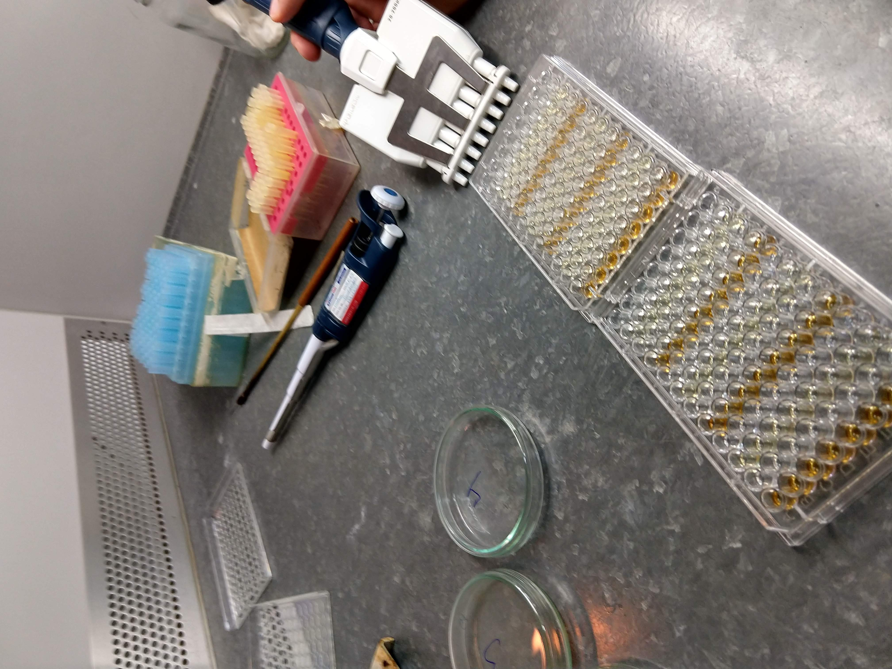{fig-align="center" width=43%}

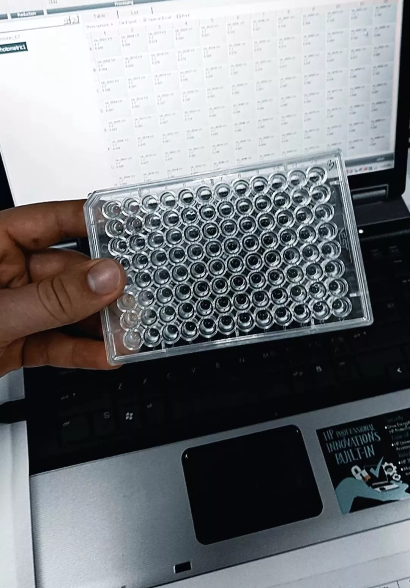{fig-align="center" width=40%}

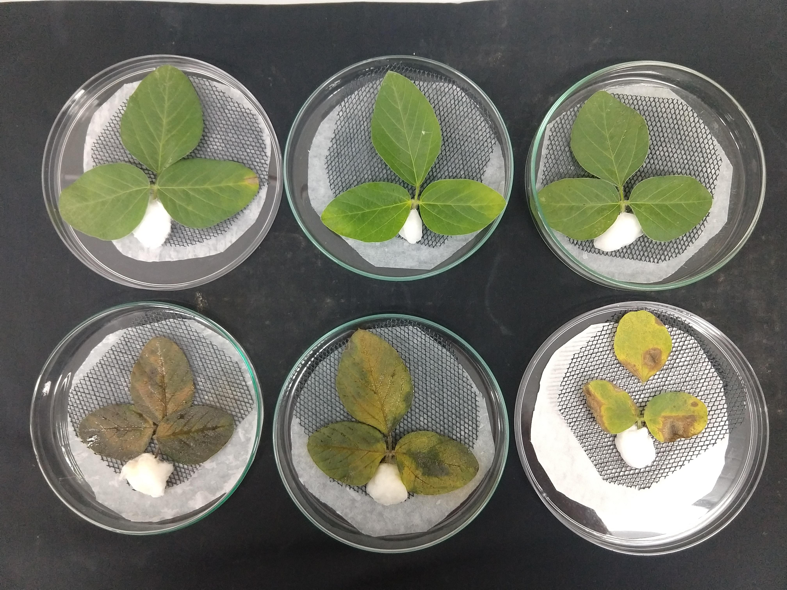{fig-align="center" width=77%}

:::

#### Teste de eficiência de fungicidas em Casa de vegetação:

::: {layout-ncol=2}

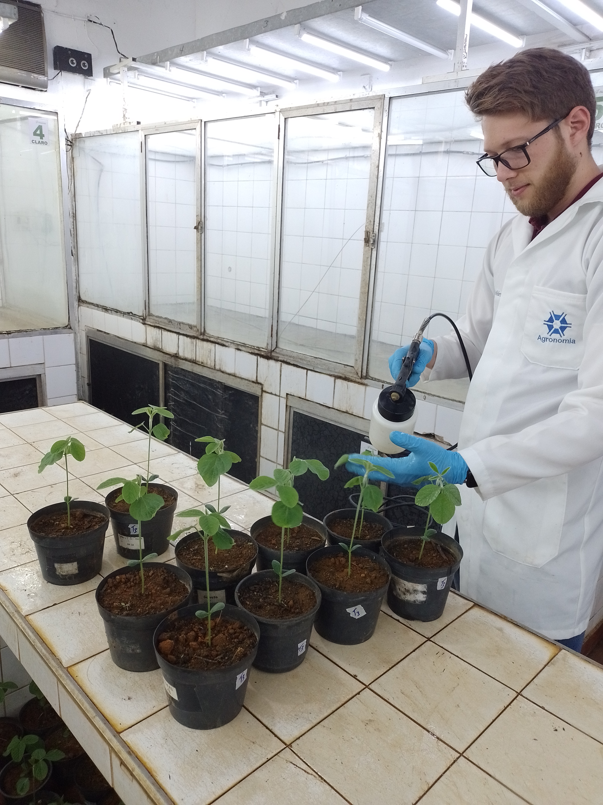{width=20%} 

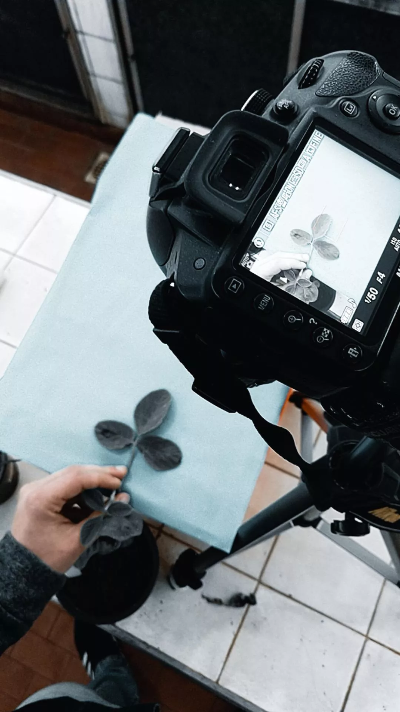{width=15%} 
:::

#### Experimentos a campo

::: {layout-ncol=3}

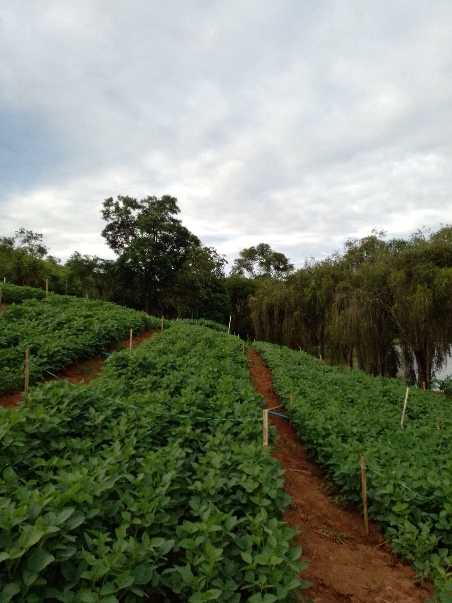{width=40%} 

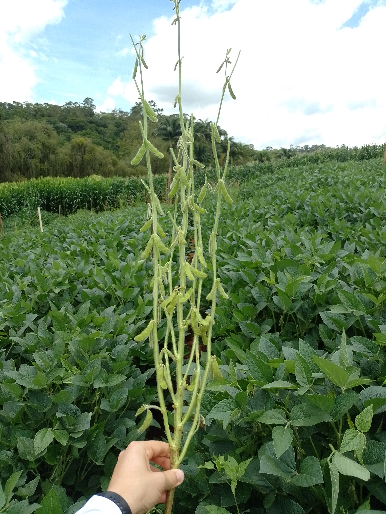{width=40%} 

{width=40%} 

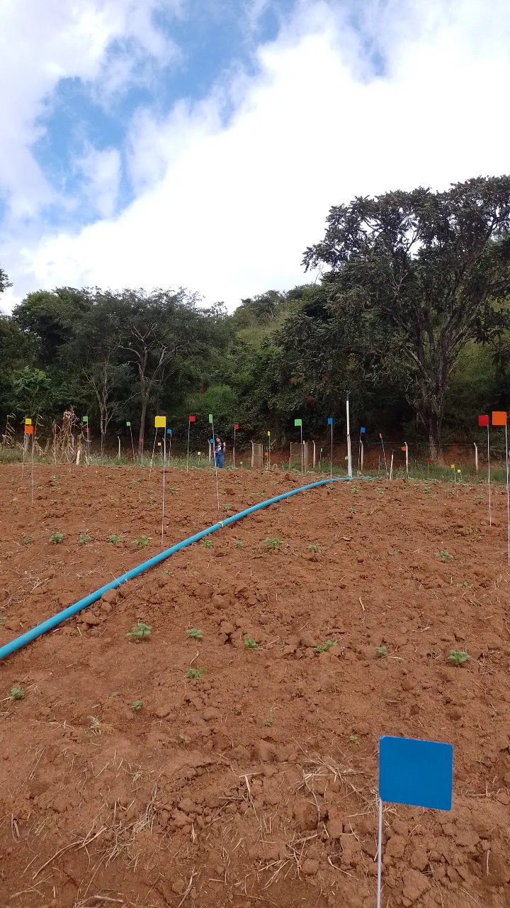{width=30%}

{width=40%} 

{width=40%}

:::

#### Analises moleculares

::: {layout-ncol=2}

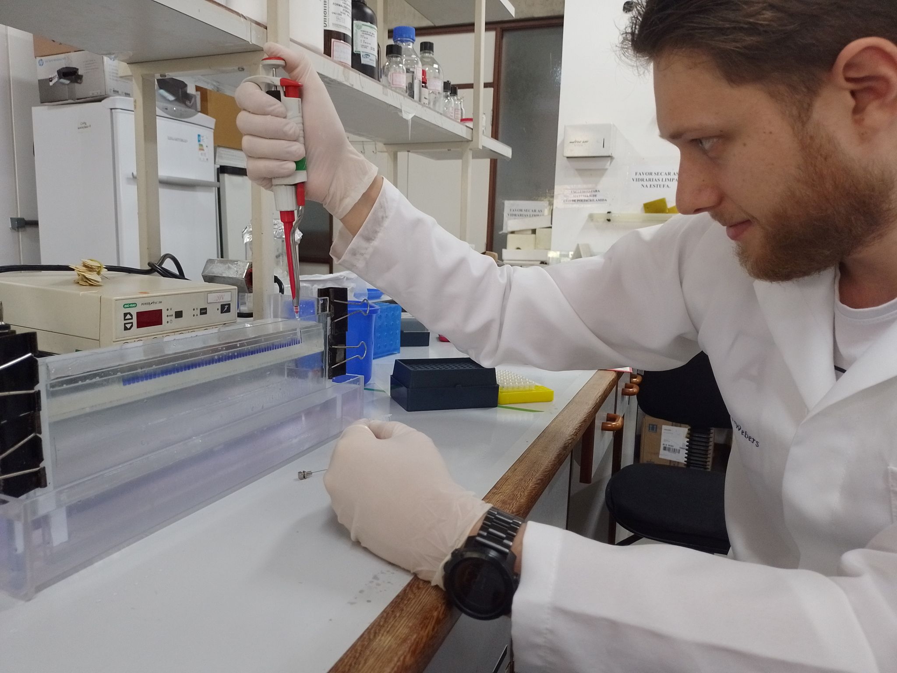{width=100%} 

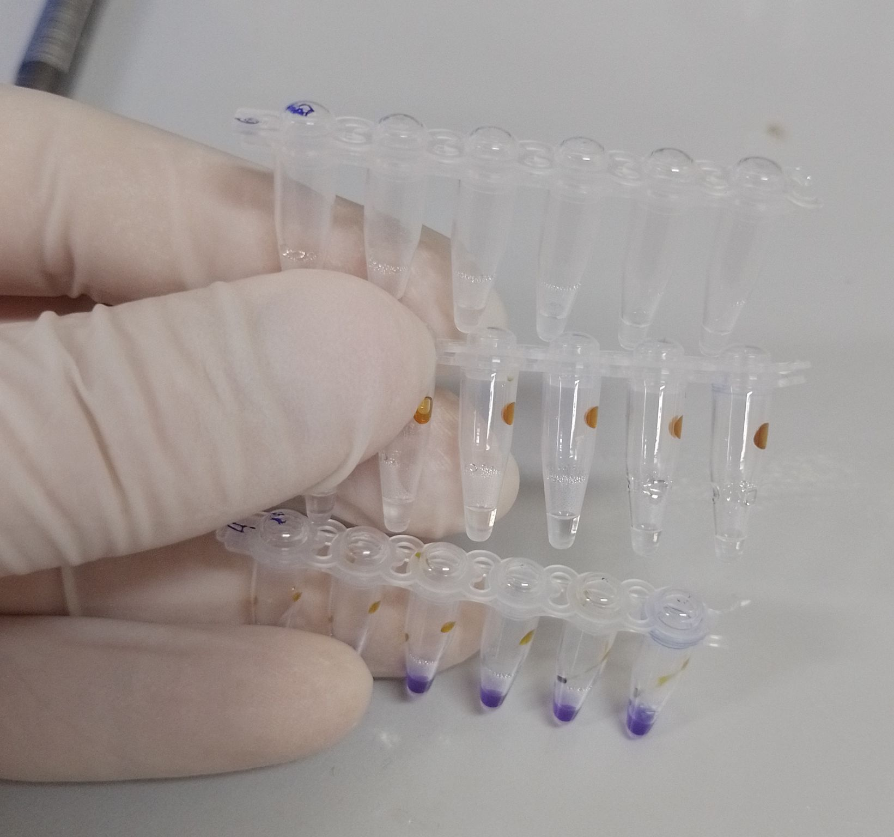{width=80%} 

:::

#### Cultivo de microorganismos

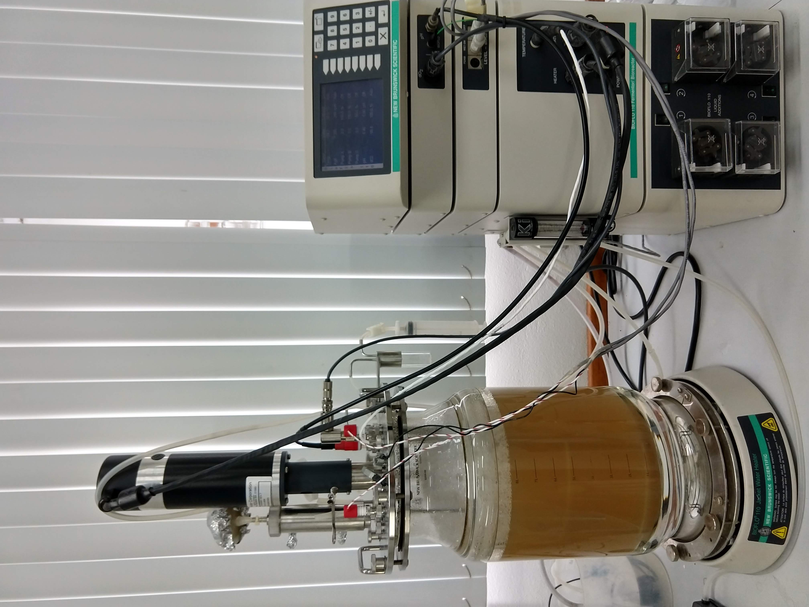{width=50%} 

#### Uso de  na analise de dados, aplicações e sites

::: {layout-ncol=2}

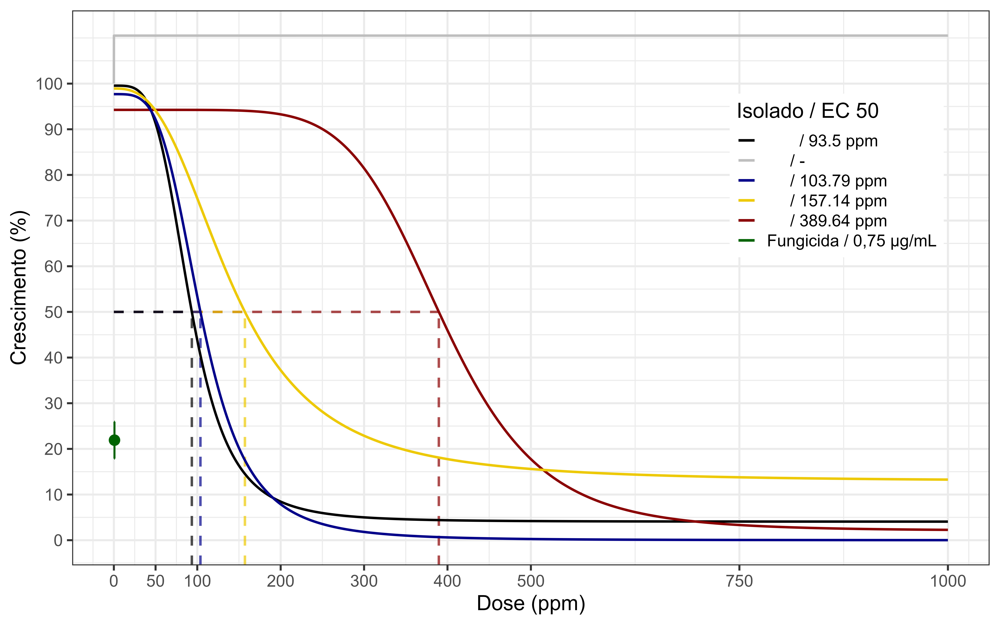{width=100%} 

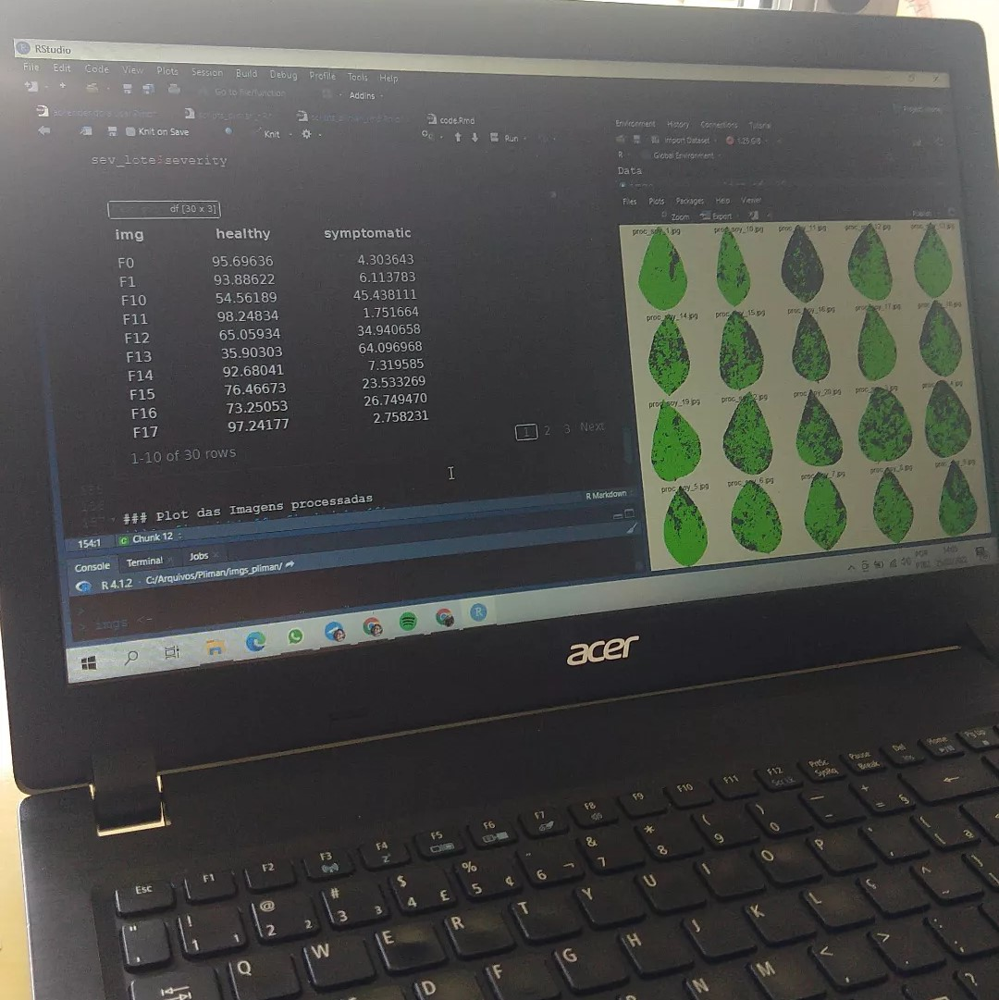{width=60%}

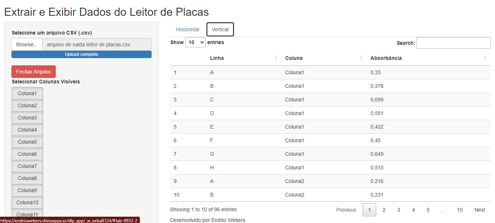{width=120%} 

:::
